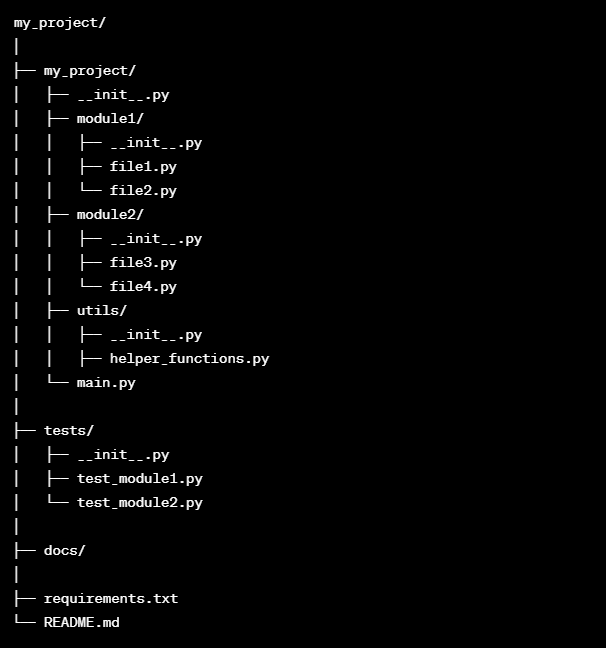

# Overview
## Goals
Py-bootstrapper creates a python3 project structure on your filesystem. This reduces the unnecessary boilerplate work at the beginning of the project.
After bootstrapping you should be good to go to kick-start an oop project, incl the following:
* folder hierarchy (see below)
* .gitignore
* virtualenv (per default taken from your python PATH var)
* testing framework

## Usage
Call bootstrap.py with the following arguments:

```python bootstrap.py testproject -prj_dir c:\\foo```
The first positional argument is your project name. -prj_dir defines the desired folder location. This can be absolute or relative (to where the script lives).
Please note: the full project tree is built under the given path.

--prj-dir is optional, if not given the directory will be created on the relative position and named like the project (arg 1).

## .gitignore
I am using most of the time a default .gitignore from GH: [https://github.com/github/gitignore/blob/main/Python.gitignore](https://github.com/github/gitignore/blob/main/Python.gitignore)
Currently this is not configurable (might happen in a future iteration). For now if you want to change the link adapt the [gitignore_url](utils/project.py).
If you dont want a gitignore at all remove the call [project.initialize_folder_file_structure()](bootstrap.py)

## venv
A virtual env is automatically created. Please note: it is not activated yet.

## My project structure


## Explanation of the structure:

### my_project/ (top-level directory):
This is the root directory of your project.
The outer my_project/ folder might include additional files like .gitignore, .editorconfig, or others specific to your needs.

### my_project/my_project/ (source code):
This is the Python package containing your project's source code.
Each subdirectory inside may represent a module or a group of related modules.
__init__.py files are included to make Python treat the directories as packages.
main.py is where the entry point of your application might be.

### my_project/tests/ (unit tests):
This folder holds your unit tests.
Each test file typically corresponds to a module in your source code.
The __init__.py file indicates that this directory should be treated as a package.

### my_project/docs/ (documentation):
This folder is for documentation files. You might use tools like Sphinx to generate documentation.

### requirements.txt (dependencies):
This file lists the project's dependencies. You can generate it using pip freeze > requirements.txt after installing your project's dependencies.

### README.md (project documentation):
This file contains information about your project, its purpose, how to install, and how to use it.


This structure is a starting point, and you can adapt it based on your project's specific requirements. As your project grows, consider breaking it into more submodules or packages to keep the structure organized and manageable. Additionally, tools like tox for testing, setup.py for package distribution, and pyproject.toml for project metadata can be added as needed.

## Docs
For more in-depth doc take a look at [docs/doc.md](docs/doc.md)
